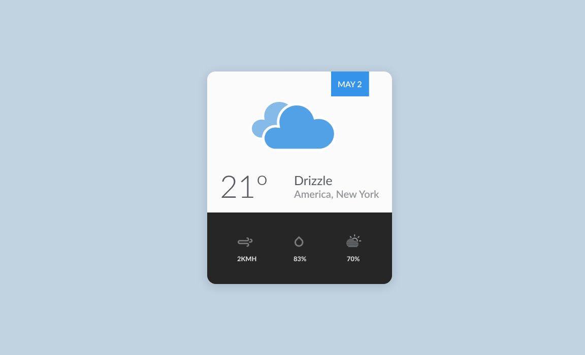

# Weather App

## Live Demo 🚀
https://weather-app-21.herokuapp.com

## Description 📝
Just as the title says, a simple weather app. The project was bootstrapped with create-react-app and was prototyped on Figma.

## Tools 🛠
* React
* Express

## APIs 📦
* [DarkSky](https://darksky.net/)
* [IpInfo](https://ipinfo.io/)

## Things I Learned
* Using async / await to get info.
* Proxying API calls.
* Handling CORS with backend.
* Express behind proxies. 
